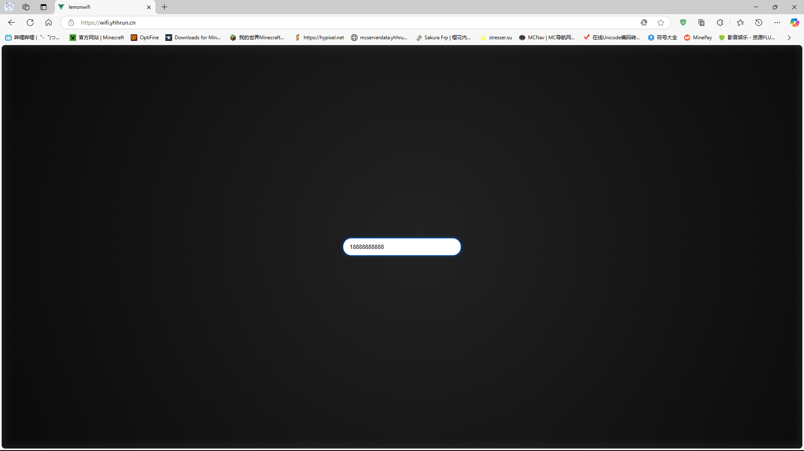
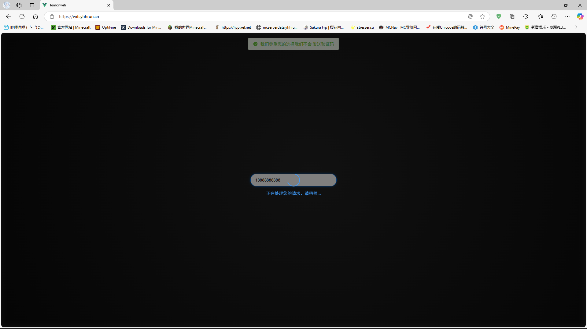

# XLemonWIfi

## 一款基于 SpingBoot Vue 开发的 柠檬Wifi 验证码获取工具
## 介绍
本项目是一个基于 Spring Boot 和 Vue.js 的柠檬 WiFi 验证码获取工具，旨在帮助用户快速获取柠檬 WiFi 的验证码。该项目使用了最新的前端和后端技术栈，提供了友好的用户界面和高效的后端服务。

## 演示站
[https://wifi.yhhrun.cn/](https://wifi.yhhrun.cn/)

## 页面展示

  
  
  
  

